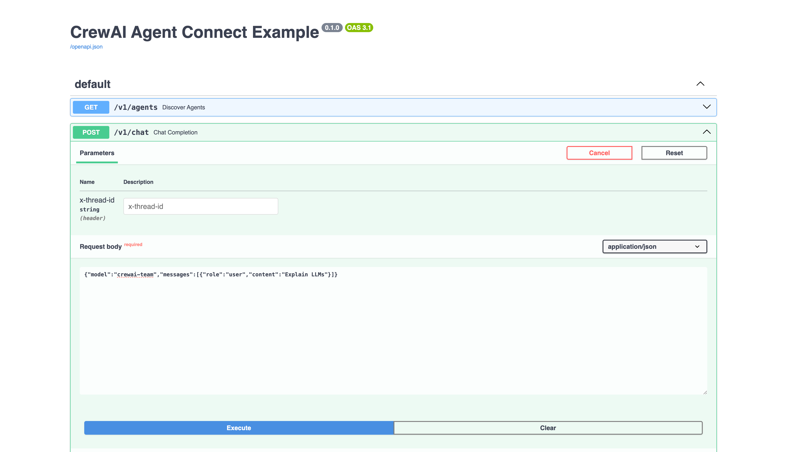
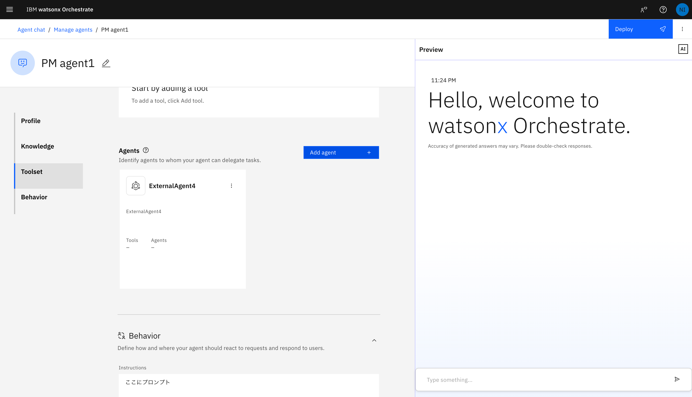
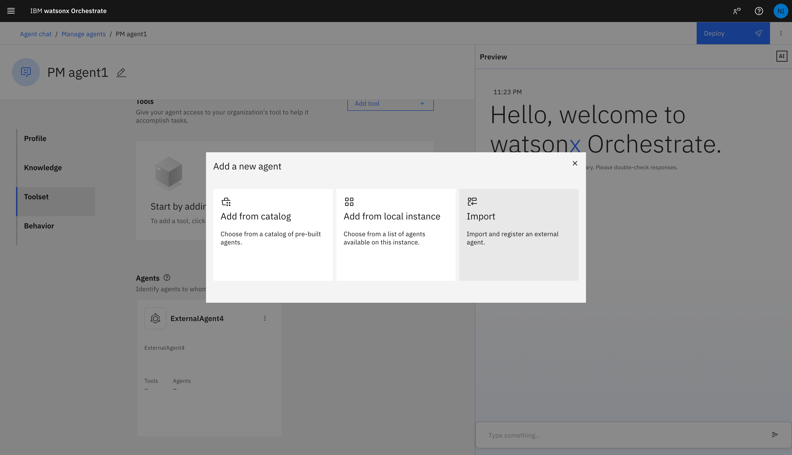
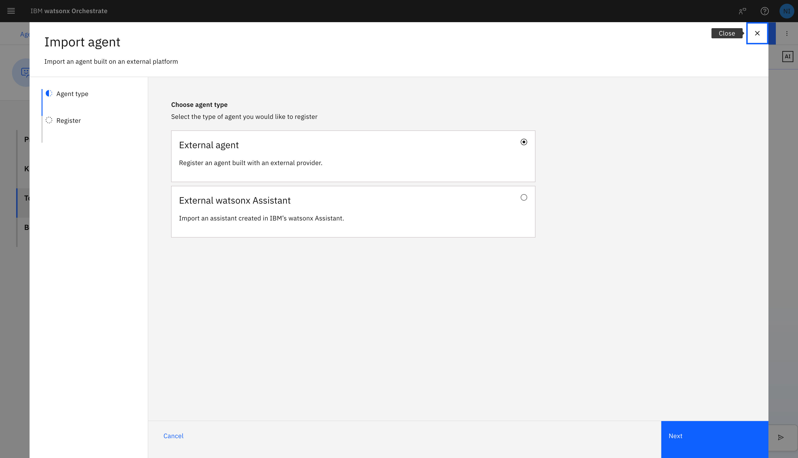
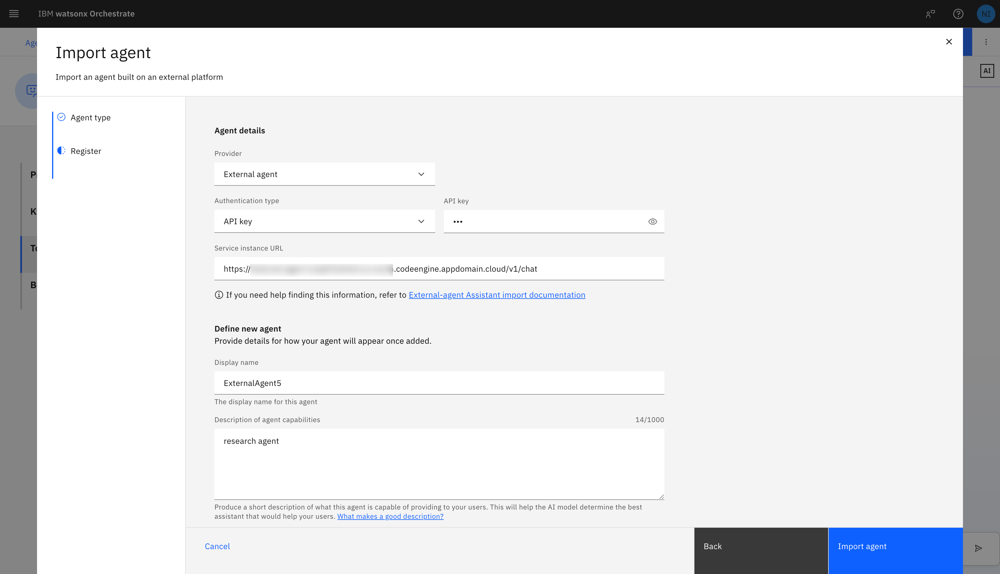
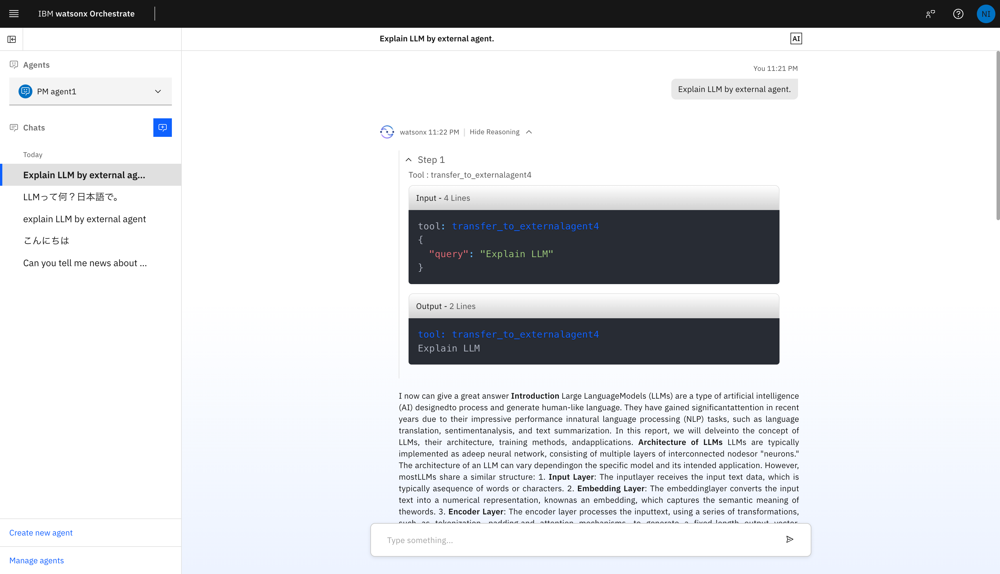

# CrewAI を用いた wxo の外部エージェント

動作確認しながらデプロイして連携する手順を以下に示す。

## 前提

- wxo は 2025/06/03 時点で新しい方の Agent 特化のやつ
- 古い情報（[watsonx-orchestrate-developer-toolkit](https://github.com/watson-developer-cloud/watsonx-orchestrate-developer-toolkit/blob/main/external_agent/examples/langgraph_python/README.md)）だと動かない
- 新しい情報（[IBM Agent Connect](https://connect.watson-orchestrate.ibm.com/introduction)）が情報たりてないので補完しながら実施

## 準備

git clone して.env.sample をコピーして.env を作成し API キー等を設定する

## Python

以下で動作確認

```
pip install --no-cache-dir -r requirements.txt
uvicorn main:app --host 0.0.0.0 --port 8080
```

以下で、OpenAPI の画面から動作確認

http://localhost:8080/docs

request body は例えば以下。model は main.py にあるように特に使われてないのでなんでも良い。

```json
{
  "model": "crewai-team",
  "messages": [{ "role": "user", "content": "Explain LLMs" }]
}
```

## Docker

下記手順でビルドして動作確認

```
docker build -t external_agent .
docker run --rm -p 8080:8080 -e WATSONX_PROJECT_ID=xxx -e WATSONX_API_KEY=xxx -e MODEL=watsonx/mistralai/mistral-medium-2505 -e WATSONX_URL=https://us-south.ml.cloud.ibm.com external_agent
```

## デプロイ

### 1. コンテナビルド・プッシュ

Container Registry x Code Engine を想定してビルド

Apple Silicon 環境でビルドする前提で、Intel 環境で動かす想定で platform を設定

```
docker build -t external_agent . --platform linux/amd64
docker tag external_agent us.icr.io/cc-xxx-cr/external_agent:latest
docker login -u iamapikey -p xxx us.icr.io
docker push us.icr.io/cc-xxx-cr/external_agent:latest
```

### 2. デプロイ

下記手順でデプロイ。

1. Container Registry のイメージを取得できるようにシークレットを設定
2. アプリケーションを作成
3. 環境変数等を設定

発行された URL に`/docs`をつけて ローカル環境と同様 OpenAPI 画面で動作確認できる



## wxo

下記手順で設定する。
URL に`/v1/chat`が必要







# 作成時のポイント

- `auth.py`を[IBM/ibmdotcom-tutorials: Repo for the storing of code and examples from tutorials.](https://github.com/IBM/ibmdotcom-tutorials)からコピペ
- `main.py`は[Examples - IBM Agent Connect](https://connect.watson-orchestrate.ibm.com/examples)からコピペ
- `Dockerfile`は[watsonx-orchestrate-developer-toolkit/external_agent/examples/langgraph_python/Dockerfile at main · watson-developer-cloud/watsonx-orchestrate-developer-toolkit](https://github.com/watson-developer-cloud/watsonx-orchestrate-developer-toolkit/blob/main/external_agent/examples/langgraph_python/Dockerfile)からコピペ。`app:app` じゃなくて `main:app` に注意

- `MODEL=watsonx/meta-llama/llama-3-2-1b-instruct`は小さいモデル。`MODEL=watsonx/mistralai/mistral-medium-2505`等の方が精度良いと思われるが時間かかる。何度も LLM を呼ぶので大きいモデルだと wxo から呼ぶ時タイムアウトしてそう。要確認。

# その他参考リンク

- [watsonx.ai でサポートされる基盤モデル — Docs | IBM watsonx](https://dataplatform.cloud.ibm.com/docs/content/wsj/analyze-data/fm-models.html?context=wx&locale=ja)

- [Introduction - CrewAI](https://docs.crewai.com/introduction)
- [Welcome to IBM Agent Connect - IBM Agent Connect](https://connect.watson-orchestrate.ibm.com/introduction)

# 関係ありそうで関係ない情報

- [Welcome to IBM watsonx Orchestrate Agent Development Kit - IBM watsonx Orchestrate ADK](https://developer.watson-orchestrate.ibm.com/)
- [watsonx-orchestrate-developer-toolkit/external_agent/examples/langgraph_python/README.md at main · watson-developer-cloud/watsonx-orchestrate-developer-toolkit](https://github.com/watson-developer-cloud/watsonx-orchestrate-developer-toolkit/blob/main/external_agent/examples/langgraph_python/README.md) (旧 wxo でのみ動く)
